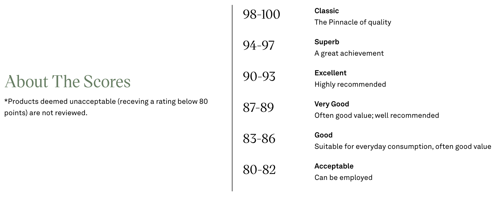
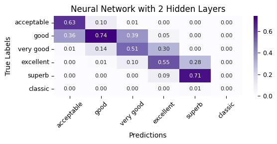
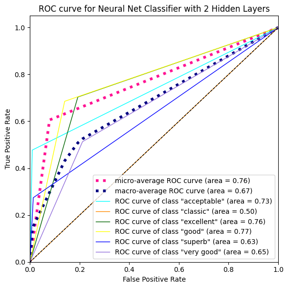

### Oenologist
> Oenologists evaluate the quality of wine and ensure it meets the desired outcome.

*Applying data science to evaluate wine quality*

**Patrick Smith**

---
#### Executive summary

In this project, we will apply natural language processing and use machine learning techniques to predict the quality of wines based on reviews written about those wines. Given that tasters reviewing the wines are [Sommeliers](https://en.wikipedia.org/wiki/Sommelier) professionally trained in the art of wine tasting, we can expect a fair amount of consistency in the reviews. We expect different Sommeliers reviewing similar wines awarding similar scores and providing similar descriptions explaining why the wines earned the points they did.

Reviews are blind, meaning tasters do not know the winery or price of the wine they taste. They will know general information including the variety, vintage (year the wine was made) and general area where the wine was made. Blind tasting allows marketplaces like [WineEnthusiast](https://www.wineenthusiast.com/about-us/) to differentiate themselves as influencers in the wine consumer industry. To maintain that influence, the review process must be consistent, repeatable and objective, which is ideal for machine learning.

  

  
Fig 1: Most common words used in wine reviews

An initial Logistic Regression model is used as a baseline model and achieved an accuracy of $51.8% $. We will train and tune supervised learning classifiers, as well as neural network classifiers, and can expect that after tuning, the prediction accuracy will increase.

---

#### Rationale
The global wine market is expected to be nearly a $\$350$ billion industry in 2025. Gross margins for vineyards and wineries are on average 50%, while wine retailers and restaurants have profit margins of nearly $30%$ and $70%$ respectively. Factors that affect these profit margins include production volume, location, size of the winery, and market positioning. Wine reviews and quality assessments impact the reputation of the wine in the market, and in term impact both the demand for and the price that can be charged for a wine. As this testimonial attests, ratings can make the difference between being a successful business, or failing.

>Last year, slow sales at Domaine Clavel resulted in an unsold stockpile, putting the winery in a tough spot. Then, in July, Wine Enthusiast awarded its Côtes du Rhône Rouge a stunning $92$ points.
>
>“I was in disbelief. A $92$-point rating for a Côtes du Rhône—it felt unreal!” Clavel recalls. The score piqued interest from Costco, which ultimately ordered $100,000$ bottles. “It changed everything. For the first time this year, I felt confident about facing the bank.”
>
>—Claire Clavel – Owner of Domaine Clavel
source: [Wine Enthusiast Ratings Testimonials](https://www.wineenthusiast.com/submit-for-rating/?srsltid=AfmBOootA0Oo9WQahh1Nyo1JoBws2j7rwSIPEgs1YKwyJB6bfhF7TeVt#ratings-help-you)

Since the points ratings drive the demand and price of wines, it is vitally important that the reviews, and the associated ratings be fair and accurate. The reputation of the marketplace awarding the rating is critical to the marketplace.

Here are three business use cases that can benefit from this research:
- Marketplaces reviewing wines can ensure their tasters are consistent and accurate.
- Wine producers can ensure their wines receive the highest ratings possible since high ratings drive sales.
- Wine distributors and restaurants can fine tune their inventories to match what their customers want.

---
#### Research Question
There are two research questions being investigated here.
1. Can the rating, be predicted from the wine review taster notes?

<i>from <a href="https://www.wineenthusiast.com/ratings/">WineEnthusiast</a></i>

#### Data Sources
The data source for this project is the WineEnthusiast [Wine Reviews](https://www.kaggle.com/datasets/zynicide/wine-reviews) data set on Kaggle. This dataset contains roughly 130k wine reviews commissioned by [WineEnthusiast](https://www.wineenthusiast.com/) between May and November 2017. 

The dataset contains thirteen (13) fields that describe:
- **what** wine is being reviewed: winery, designation, variety, vintage (in review title), price
- **where** the wine is from: country, province, region_1, region_2
- **who** reviewed the wine: taster_name, taster_twitter_handle
- the review and resulting **rating**: description, points

After data cleaning and extracting features from the wine review descriptions, the dataset consisted of $98,460$ samples each with $837$ features extracted from One Hot Encoders of varieties, augmenting numerical data given relationships discovered during Exploratory Data Analysis, and converting reviews to sentence embeddings using the [all-mpnet-base-v2](https://huggingface.co/sentence-transformers/all-mpnet-base-v2) pre-trained model that captures the semantic meaning of the review using a $768$ dimensional dense vector.

#### Methodology
1. After getting to know the data and deciding what features to use, how to handle duplicate and missing data, an exploratory data analysis will be performed to understand the distribution of target classes, and how features relate to the target and each other.
1. Then, since we are trying to extract features from the wine reviews, various natural language processing techniques will be assessed, including bag-of-words (BoW) and term frequency-inverse document frequency (TF-IDF) and compared to sentence embeddings to determine how to extract information from the reviews.
1. Then several popular supervised learning models will be trained on a subset of the data to determine which models to train the entire dataset on based on training time and relative performance.
1. And finally, a decision will be made on which target representation to use, points, or rating categories.
1. Once the features, models, and target have been selected, three supervised learning models will be trained and compared to a baseline result.
1. And a neural network will be trained and compared to the machine learning classifiers.

##### Evaluation Metric
Classification Accuracy and Confusion Matrices are the primary evaluation metric used. The classification accuracy provides an overall ratio of classes that are correctly predicted relative to the true value. In contrast, the confusion matrix provides insights into the types of misclassification errors the various classifiers make.

#### Results
What did your research find?
- $53.6%$ wines are only reviewed once
- $5.4%$ wines are only reviewed once
- $99%$ of wines reviewed come from $15$ countries
- the top $50$ varieties reviewed account for $89%$ of all the reviews in the dataset
- $93.7%$ of the wines reviewed were released after $2003$.
- The average rating for the $130k$ wine reviews is $88$ points.
- Only $4$ varieties have an average rating above $90$ points.
- The top winery has a median rating of $94$ points.
- The most prolific reviewer tastes one specific variety $50\text{x}$ more than any other vareity.
- Ratings by taster are very close normal distributions with means around $87$ or $88$ points, which is expected.
- The reviews for top rated wines are $2\text{x}$ as long as average wines.
- Using review length alone as a baseline, a trained LogisticRegression classifier achieved an accuracy of $51.8%$.
- After hyperparameter tuning, an XGBoost classifier using sentence embeddings features extracted from a pretrained large language model achieved an accuracy of $52.8%$.
- A neural network classifier with 2 hidden layers achieved an accuracy of $60.3%$.

The classification errors made by the neural classifiers are close to the diagonal, indicating that the neural classifier generally understood the quality of the wine, but missed some nuances of wines in adjacent categories. In contrast, the XGBoost classifier made large errors far off the diagonal. For example, it $38%$ of the wines labeled `acceptable` were in face `excellent` wines. Such a misclassification can be devastating, not just to the winemaker, but also the marketplace publishing the review.

  &nbsp;

The receiver operating characteristic (ROC) curve shows how well the classifier does by target classes. The $classic$ target class has very few samples. The ROC curve indicates shows the classifier is unable to correctly classify this class. Other classes like $good$ or $excellent$ perform much better, partly because there are more samples.

  

#### Next steps
  - Collecting more data, especially the full tasting notes from all tasters.
  - Additional data augmentation. Given lat-lon coordinates of wineries, add soil and precipitation data during growing season. Use in climate prediction applications to predict quality of wines given changing soil conditions and weather patterns. Tasters know this about the wines when they taste it. They look for the effects of climate and location when tasting.
  - Cutting-edge systems like [eTaste](https://www.theguardian.com/science/2025/feb/28/scientists-create-e-taste-device-that-could-add-flavour-to-virtual-reality-experiences) can be used to measure and calibrate wine tasters.

#### Outline of project

1. [Understanding the data](data_understanding.ipynb), get to know the data.
1. [Data Cleaning](data_cleaning.ipynb), make decisions about missing values, duplicates, outliers, data formatting & interpretation.
1. [Exploratory Data Analysis](exploratory-data-analysis.ipynb), explore whether classes are balanced, distributions of values, and relationships between features, etc.
1. [Feature Selection](feature-selection.ipynb), determine which natural language processing technique to use to extract features from the review descriptions
1. [Model Selection](model-selection.ipynb), explore several popular classifier models on a subset of the data to determine which models to train and tune
1. [Target Selection](target-selection.ipynb), determine which target classes to use based on the features that can be extracted from reviews
1. [Model Training](model-training.ipynb), train and tune three ($3$) classifiers
1. [Neural Network Classifier](neural-classifier.ipynb), train two(2) neural network classifiers to compare to the supervised learning classifiers.
1. [Summary](summary.ipynb), discuss conclusions and next steps.

##### Contact and Further Information
For information about this project, please contact `tuque_smith` on Kaggle.

#### Repository Layout
- /images - images included in README files
- /references - notebooks focusing on specific topics like embeddings or wordcloud to use as reference
- /utils - python code helpers
- *.ipynb - notebooks for this project, see outline above
- README.md - this file
- requirements.txt - required libraries for this project.

  **Additional Download Instructions**:
  - spaCy pretrained [en_core_web_lg](https://spacy.io/models/en#en_core_web_lg) model

---
#### Criteria
**Project Organization**
- [x] README file with summary of findings and link to Jupyter Notebook(s)
- [x] Jupyter notebook(s) with headings and text appropriately formatted
- [ ] No unnecessary files
- [x] Directories and files with appropriate names

**Syntax and Code Quality**
- [x] Libraries imported and named correctly
- [x] Code with no errors
- [x] No long strings of code output
- [x] Demonstrate competency with pandas
- [x] Demonstration competence with viz libraries
- [x] Appropriate use of comments
- [x] Sensible variables

** Visualizations:
- [x] Appropriate plots for categorical and continuous variables
- [x] Plot with human-readable labels
- [x] Plots with descriptive titles
- [x] legible axes
- [x] Appropriate use of subplots when necessary
- [x] Plots that are scaled appropriately

** Modeling:
- [x] Multiple regression or classification models
- [x] Cross-validation of models
- [x] Grid Search hyperparameters
- [x] Appropriate interpretation of models
- [x] Appropriate interpretation of evaluation metric
- [x] Clear identification of evaluation metric
- [x] Clear rationale for use of given evaluation metric

Findings:
- [x] Clearly states business understanding of the problem
- [x] Clean and organized notebook with data cleaning
- [x] Correct and concise interpretation of descriptive and inferential statistics
- [x] Clearly states findings in their own sections, with actionable items highlighted in appropriate language for a nontechnical audience
- [x] Next steps and recommendations
