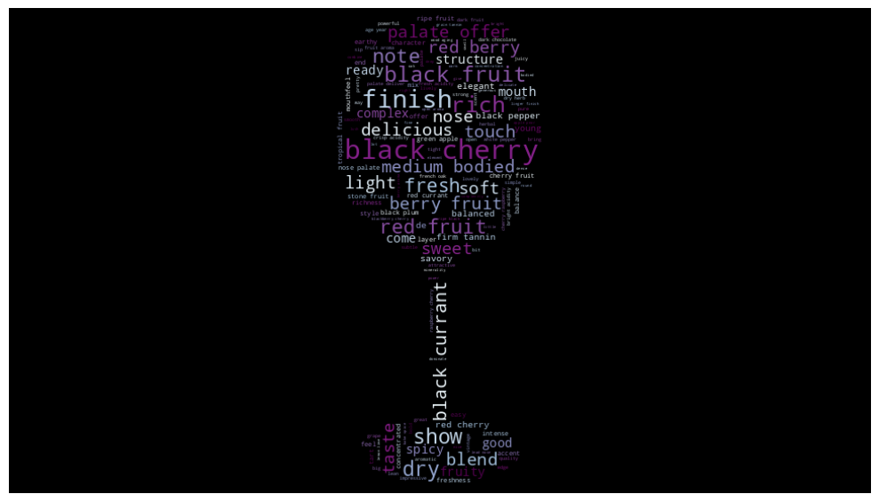
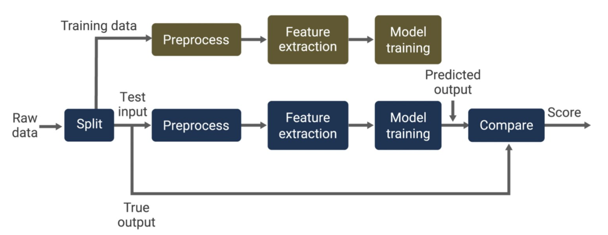

### Oenologist

**Patrick Smith**

---
#### Executive summary

Why `Oenologist`?
> Oenologists evaluate the quality of wine and ensure it meets the desired outcome.

*Applying data science to evaluate wine quality*

In this project, we will use machine learning techniques to predict the quality of wines based on reviews written about those wines. Given that the tasters reviewing the wines are [Sommeliers](https://en.wikipedia.org/wiki/Sommelier) professionally trained in the art of wine tasting, we can expect a fair amount of consistency in the reviews. We expect different sommeliers reviewing similar wines awarding similar scores and providing similar descriptions explaining why the wines earned the points they did.

Part of what drives this consistency is that these wine reviews are blind. The tasters do not know the winery or winemaker, when they taste the wine. Depending on the task, they may know the varietal and general provenance and/or vintage (year) the wine was made. This methodology allows marketplaces like [WineEnthusiast](https://www.wineenthusiast.com/about-us/) to differentiate themselves as influencers in the wine consumer industry. To maintain that influence, the review process must be consistent, repeatable and objective, which is ideal for machine learning.

In fact, because of this consistency, we can expect the reviews to result in clustering similar to those shown in the infographic below to emerge from the reviews. 

  

  
Fig 1.: Most common words used in wine reviews

We will apply machine learning methods to predict the **quality** a wine should get based on the review it obtained. We can apply this both from a blind tasting (without knowing the winery) and a branded tasting (where the winemaker is revealed).

An initial Logistic Regression model with default parameters was able to achieve $74\%$ accuracy in predicting quality in a branded tasting mode where both the descriptions and the winery and taster data were included as features. We expect that after tuning, the prediction accuracy will increase.

---

#### Rationale
The global wine market is expected to be nearly a $\$350$ billion industry in 2025. Gross margins for vineyards and wineries are on average 50%, while wine retailers and restaurants have profit margins of nearly $30\%$ and $70\%$ respectively. Factors that affect these profit margins include production volume, location, size of the winery, and market positioning. Wine reviews and quality assessments impact the reputation of the wine in the market, and in term impact both the demand for and the price that can be charged for a wine. As this testimonial attests, ratings can make the difference between being a successful business, or failing.

>Last year, slow sales at Domaine Clavel resulted in an unsold stockpile, putting the winery in a tough spot. Then, in July, Wine Enthusiast awarded its Côtes du Rhône Rouge a stunning 92 points.
>
>“I was in disbelief. A 92-point rating for a Côtes du Rhône—it felt unreal!” Clavel recalls. The score piqued interest from Costco, which ultimately ordered 100,000 bottles. “It changed everything. For the first time this year, I felt confident about facing the bank.”
>
>—Claire Clavel – Owner of Domaine Clavel
source: [Wine Enthusiast Ratings Testimonials](https://www.wineenthusiast.com/submit-for-rating/?srsltid=AfmBOootA0Oo9WQahh1Nyo1JoBws2j7rwSIPEgs1YKwyJB6bfhF7TeVt#ratings-help-you)

Since quality points ratings can drive the demand and price of wines, it is vitally important that the reviews, and the associated ratings be fair and accurate.

Here are three business use cases that can benefit from this research:
- Wine producers are interested in ensuring their wines receive the highest ratings their wines can earn. As the testimonial mentioned above, this can make or break their business.

- Wine marketplaces need to protect the reputation and influence on the market their reviews have. To do this, they need to operationalize a distributed global corps of reviewers at scale to continuously taste new wine releases and offerings while maintaining the consistency and predictability that makes their ratings influential. Onboarding new wine reviewers in ways that don't jeopardize the reputation of the marketplace is a challenge. A new, unknown reviewer could do real harm if a review is published without review. However, duplicating reviews is costly. Statistical techniques, and machine learning techniques can minimize the costs involved in ramping and training new reviewers, all while preserving the standards and quality of the review process. AI can even provide coaching to help train and onboard reviewers.

- Wine distributors and restaurants can fine tune their inventories and increase profit margins by finding alternatives wine offerings that are equivalent in taste but cheaper. They might be able to achieve higher markup while offering the customer slightly cheaper alternatives.

---
#### Research Question
There are two research questions being investigated here.
1. A clustering exercise to see to what extent we can reproduce the 9 common wine style grouping, and the 5 basic wine types, from the descriptions.
1. Based on the description, we want to see if we can predict the points a wine would receive based on the review it received.

- **Text Classification**: Assigning categories or labels to text documents based on their content. Examples include spam detection, topic classification, and sentiment analysis.
- **Sentiment Analysis**: Determining the sentiment (positive, negative, neutral) expressed in a piece of text, which is useful for analyzing customer feedback, social media posts, and reviews.

#### Data Sources
The data source for this project is the WineEnthusiast [Wine Reviews](https://www.kaggle.com/datasets/zynicide/wine-reviews) data set on Kaggle. This dataset contains roughly 130k wine reviews commissioned by [WineEnthusiast](https://www.wineenthusiast.com/) between May and November 2017. 

#### Methodology
There two distinct machine learning goals in this project.

1. The first objective is an unsupervised learning application where we want to confirm that patterns exist in the reviews that align with the wine styles and wine classification. For this problem, we will consider applying Agglorimative clustering Analysis to reproduce the 9 common wine styles and 5 basic wine groupings based on the wine descriptions. This will confirm whether patterns exist in the data that can be used to predict quality in ways we can explain or understand.

    To accomplish this, we will apply natural language processing techniques (NLP) to convert textual reviews into features we can use in clustering algorithms. The conversion process involves:
      - **tokenization** that converts the review content into word tokens.
      - These tokens then undergo a **normalization** process to improve the quality of the tokens. The tokens are processed to remove things like punctuation and words with low information values (called stop words) or names, convert to canonical form (called stemming), etc. all to reduce the tokens to a minimal set of highly informative tokens.
      - After normalization, **vectorization** converts the word tokens into vectors of numbers that represent the words included in the review.
      - This sparse matrix is the feature matrix that is fed to the clustering algorithm to discover patterns in the data

2. The second objective is a supervised learning classification problem where we want to predict the points a wine should earn based on the review it received.

  

  
Fig 2.: Machine Learning Workflow

Since this is a supervised learning process, as the workflow diagram above indicates, first we need to reserve some data to test the model after the training and tuning is completed. The remainder of the data is used to train the model.

Again the descriptions have to go through the tokenization and normalization preprocessing and vectorization feature extraction steps. Then Models are trained and compared. Cross validation will be used to tune the model hyperparameters to determine the parameters that result in the best models. Ensemble and Neural Network classifiers will also be trained and evaluated.

Once the best model is identified, its performance will be measured. Accuracy and confusion matrix will be used as the main performance measures.

This is the model that would be put into service, for example, by a wine marketplace to train, coach and monitor its professional wine reviewers.

>**Note**:
>Since the corpus is so large, the development of the modeling code will be performed on a much smaller set of the data to verify the coding is structurally correct. Once the coding is complete, then the model will be trained on the full corpus.

#### Results
What did your research find?

*Work In Progress*
  - I am expecting to be able to reproduce the grouping of basic wine types and wine styles from the descriptions.
  - I am expecting to be able to predict the quality of a wine to better than $74\%$ accuracy.

#### Next steps
  - Create a Task Management System powered by this machine learning model that can onboard new wine reviewers while minimizing the cost required to maintain the accuracy and integrity of the review process.
  - Additional data augmentation. Given lat-lon coordinates of wineries, add soil and precipitation data during growing season. Use in climate prediction applications to predict quality of wines given changing soil conditions and weather patterns.

#### Outline of project

1. [initial data exploration](wine_review-initial_data_exploration.ipynb), get to know the columns of the data 
1. [data cleaning](wine_review-data_cleaning.ipynb), make decisions about missing values, duplicates, outliers, data formatting & interpretation. In this step we create a "clean" dataset that we persist for use in following steps.
1. [exploratory data analysis](wine_review-eda.ipynb), explore whether classes are balanced, distributions of values, relationships bewteen features, etc.
1. [preprocess](wine_review-preprocess.ipynb), explore and validate the preprocessing steps we want to take to convert textual descriptions into a set of high information tokens for machine learning
1. [parallel preprocessing](wine_reviews-parallel_processing.ipynb) of the wine reviews, given how costly it is to preprocess the descriptions for NLP, parallelize the preprocessing of the data, and persist for use in following steps.
1. [feature extraction](wine_review-feature_extraction.ipynb)
1. [train initial model](wine_review-baseline_model.ipynb)

 
##### Contact and Further Information
For information about this project, please contact `tuque_smith` on Kaggle.

----
#### Project Tasks
- [x] get to know the data
- [x] clean the data
- [x] data augmentation: vintage year
- [x] data augmentation: wine style ([9 styles](https://winefolly.com/deep-dive/everything-you-need-to-know-about-wine-in-9-bottles/))
- [x] data augmentation: wine type ([5 basic types](https://winefolly.com/deep-dive/different-types-of-wine/))
- [x] data augmentation: price band ([wine pricing segments](https://winefolly.com/lifestyle/reality-of-wine-prices-what-you-get-for-what-you-spend/))
- [x] data augmentation: old vs. new world classification ([difference between new and old world wine](https://winefolly.com/deep-dive/new-world-vs-old-world-wine/))
- [ ] data augmentation: geolocation of winery
  - [x] unique set wineries in reviews
  - [x] clipping areas for reverse geocoding
  - [x] extract winery Points of Interest from OSM database by country/region
  - [ ] match to unique wineries
  - [ ] set `lat` `lon` coordinates to wineries in review dataset
- [x] perform Univariate Exploratory Data Analysis
- [x] perform Multivariate Exploratory Data Analysis
  - [ ] points distribution by top region
  - [ ] variety, region, quality correlation
  - [ ] shared reviewers across varieties & quality
  - [ ] average and top scores/price by country/variety
- [x] preprocess data for NLP feature extraction from `description`
- [x] NLP feature extraction from `description`
- [ ] Hugging Face to enhance quality of tokens, synonyms?
- [ ] Unsupervised Learning cluster analysis, such as [Agglomerative](https://medium.com/@muratgulcan/hierarchical-clustering-with-python-basic-concepts-and-application-cd5f5dc95b1f) Clustering Analysis
  - cluster varieties and top common words
    >***Cluster — 1***
    >
    >Varities: Garganega, Glera, Prosecco, Moscato
    >
    >Top Words: peach, aromas, honey, sweet, stone, fruit, mineral, flower, creamy, fresh, citrus, offers, tones, almond, pair, floral, mouth, apricot, crisp, opens
    >
    >***Cluster — 2***
    >
    >Varities: Sauvignon
    >
    >Top Words: tomato, aromas, peach, exotic, fruit, palate, offers, crisp, fresh, acidity,     >mineral, stone, delivers, citrus, yellow, grapefruit, aromatic, green, mouth, note
    >
    >...
  - [visualization](images/clustering_variety.jpg) of grouping of varieties by style
- [x] train & evaluate initial baseline model
  - [ ] top words per variety/quality
- [ ] train & evaluate alternative [multiclass classification](https://learn.microsoft.com/en-us/azure/machine-learning/algorithm-cheat-sheet?view=azureml-api-1) models
  - [ ] Logistic Regression
  - [ ] Naive Bayes
  - [ ] K-nearest neighbors
  - [ ] Multinomial Logistic regression
  - [ ] Decision trees
  - [ ] Support vector machine
  - [ ] Decision Forest
  - [ ] One-v-One Multiclass
  - [ ] One-v-All Multiclass
  - [ ] Boosted Decision Tree
- [ ] tune hyperparameters for multiple models
- [ ] train ensemble classifier
- [ ] train neural classifier
- [ ] compare model performance and select prod model
- [ ] extract insights from results
  - [ ] top TF-IDF words grouped by variety/quality

----
#### Questions for Advisor
 - [ ] ColumnTransforer in NLP
 - [ ] Unsupervised Learning [cluster](https://medium.com/@nomannayeem/clustering-with-confidence-a-practical-guide-to-data-clustering-in-python-15d82d8a7bfb) analysis, such as [Agglomerative Clustering](https://medium.com/@muratgulcan/hierarchical-clustering-with-python-basic-concepts-and-application-cd5f5dc95b1f), [Hierarchical clustering](https://medium.com/@u0808b100/unsupervised-learning-in-python-hierarchical-clustering-t-sne-41f17bbbd350)
 - [ ] [Hugging Face](https://huggingface.co/) models
 - [ ] top X words associated with a variety/quality
 - [ ] [heat map](https://clustergrammer.readthedocs.io/interacting_with_viz.html) of words in 90% by variety/location
 - [ ] plots of words colored by group/wine variety
 - [ ] [StratifiedKFold](https://scikit-learn.org/stable/modules/generated/sklearn.model_selection.StratifiedKFold.html) for cross validation
 - [ ] extract top words from TF-IDF
